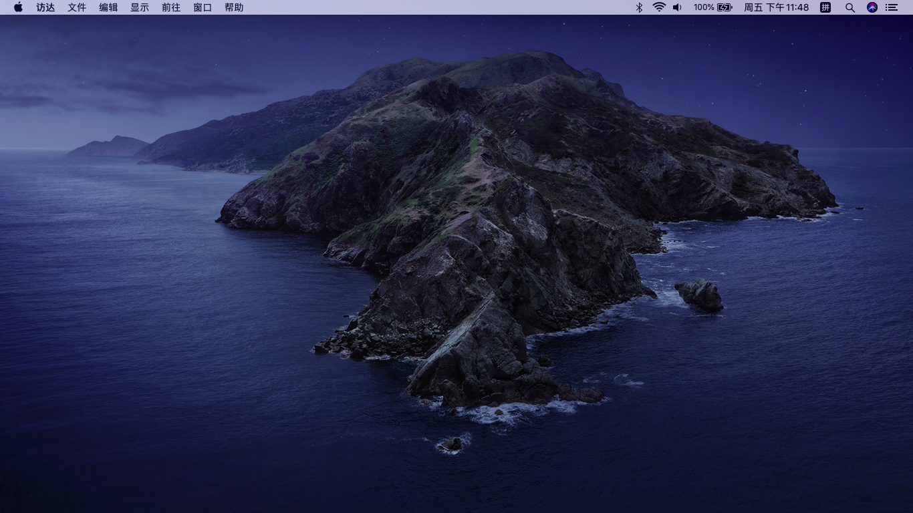
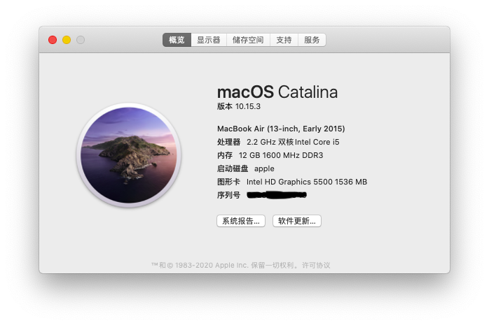

# ACER Aspire E5-471G Hackintosh Clover

---

硬件|型号
---|:--:
CPU|i5 5200u
集显|intel hd5500
内存|三星DDR3 12G(原配4G太小,可以自行加多一条内存)
声卡|Realtek ALC283
独显|NVIDIA 840M
有线网卡|Realtek rtl8188
---

## 工作：
集成显卡&radic;
1080P输出&radic;
有线网卡&radic;
HDMI&radic;
VGA&radic;
声卡&radic;
摄像头&radic;

## 不工作:
wifi&蓝牙&times; (可以在咸鱼上收一个BCM94352HMB，wifi直接免驱，蓝牙放入三个kext就可以了)
多点触控I2C&times;（ACPI缺少太多）
读卡器&times;

## 安装镜像:
https://blog.daliansky.net/macOS-Catalina-10.15.3-19D76-Release-version-with-Clover-5103-original-image-Double-EFI-Version.html

## 安装方法:
安装黑果小兵的方法把镜像刻录到u盘，然后挂载EFI分区，将这个github的CLOVER文件夹直接替换，看好版本了，clover5103，然后引导u盘安装

## 注意：
+ 触摸板请在bios里面把驱动改成basic，不要用Advance,不然键盘和触摸板会挂
+ 如果你没有换无线网卡，请把kexts/Other/BrcmBluetoothInjector.kext BrcmFirmwareData.kext BrcmPatchRAM3.kext删掉，免得启动不了
+ VoodooPS2Controller_v1.9.2.kext这个驱动不建议用acidanthera的新版，触摸板会不可用
+ 有一定概率会在连接hdmi启动时亮度重置，原因未知
+ USBInjectAll.kext是根据主板定制好的，不要更换成其他

## 说明:
DSDT.aml 加入了亮度方法 _Q8E和_Q8F
SSDT-PNLF.aml 亮度控制补丁
SSDT-XOSI.aml 操作系统方法补丁，缺少引导卡死
config.plist内还有usb和其他ACPI的修复，自行查看

